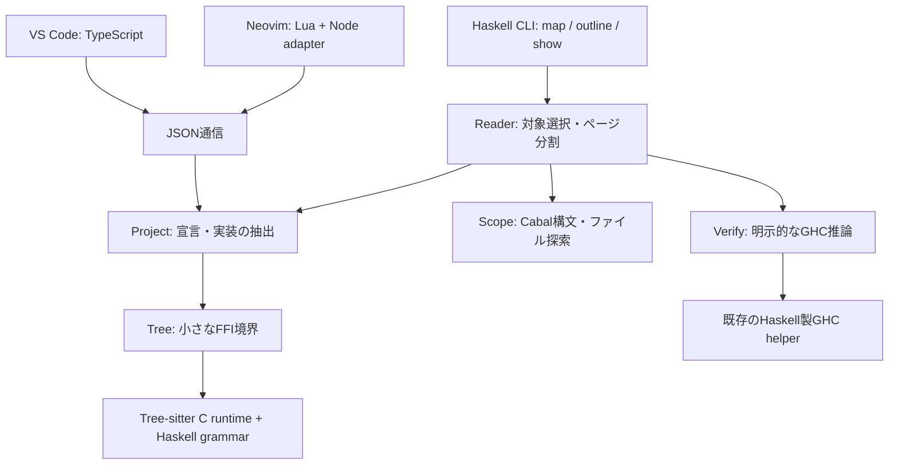

# Haskellで共有する解析器

CLIで型を読むときも、VS CodeやNeovimで型ビューを開くときも、同じHaskellの関数が宣言を取り出します。
0.6.0では、従来TypeScriptにあった抽出処理と読取コマンドをHaskellへ移しました。
単体CLIは、ビルド済みの実行ファイルだけで起動できます。

## コードの分担



`native/src/HaskellDesign/Project.hs` が、構文木から型・データ定義・関数の実装を取り出します。
抽出の中心は `projectTree` と `symbolsTree` という純粋関数です。
`Reader.hs` がファイルや名前空間で絞り、完全な宣言ごとに出力します。
`Scope.hs` は `Cabal-syntax` を使ってプロジェクトのソース配置を読みます。

Haskellの文法自体は、以前と同じTree-sitter Haskell 0.23.1です。
Wasm版からCランタイム0.25.10に切り替え、小さなFFI経由で呼びます。
編集中の不完全なソースにも対応するため、この構文解析とGHCの型検査は分けています。
文法からすべてHaskellで書き直したわけではありません。

TypeScriptとLuaには、UI、ファイル監視、エディタの信頼設定、解析結果のキャッシュが残ります。
両エディタは `Projector` から常駐するHaskellプロセスへJSONを送り、同じ結果を受け取ります。
型推論とIO判定を行うGHC helperもHaskell製です。CLIはHaskellから、エディタは既存の監視・キャッシュ経路から呼びます。

## 同じゲームで比べた結果

Afterlightの `src`・`tools`・`web` にある31ファイル、379宣言を使いました。
Windows x64、Core i7-13620H、Node.js 24.13.0、GHC 9.6.7の環境で、
旧0.5.0と新0.6.0を交互に実行しています。最初の2回を除き、10回の中央値を示します。

| 起動から全出力を受け取るまで | Node版 | Haskell版 | 所要時間の短縮 |
| --- | ---: | ---: | ---: |
| ファイル一覧 `map` | 217 ms | 154 ms | 約29% |
| 型・データ定義 `outline` | 219 ms | 155 ms | 約29% |
| `Garden.Change.apply` の取得 | 220 ms | 148 ms | 約33% |

プロセスの起動は毎回含み、ファイルシステムのキャッシュは温まった状態です。
GHCによる型推論は含めていません。ソースを絞る条件と出力上限を揃え、
スナップショットID以外の出力が一致することを確認してから比較しました。
CPPとTHに関する2ファイルの警告も、両版で同じです。

常駐プロセスで31ファイルを繰り返し解析する比較は **82 ms → 78 ms** でした。
Haskell側にはJSON通信の時間も含みます。こちらの差は小さく、エディタ全体の操作が
大幅に速くなるという結果ではありません。今回の速度上の利点は、繰り返し起動するCLIで明確でした。

計測値と条件は [JSON記録](benchmarks/windows-0.6.0.json) にあります。
再現するときは、0.5.0のコミット `485d376a1da3c6c33cd7b95c360569d601c1e038` を別フォルダでビルドし、
その `dist` を指定します。測定中は他のビルドやエディタ検証を止めてください。

```sh
node editors/haskell-design/scripts/benchmark-reader.mjs --baseline /path/to/old/editors/haskell-design/dist --root . --include src --include tools --include web
```

## 配布と導入で変わること

- 単体CLIの構文読み取りには、NodeもGHCも不要です。WindowsではPATHから両方を外して起動を確認しています。
- VSIXとNeovimアーカイブはOS・CPU別です。Windows x64の実行ファイルは約43 MiB、VSIXは圧縮後約9 MiBです。
- ソースからのビルドにはGHC/CabalとCコンパイラが加わります。Tree-sitterのランタイムは固定バージョン・SHA-256照合付きで取得し、Haskell側の依存はCabalのfreezeファイルに記録しています。
- Windowsで同じチェックアウトを再ビルドするときは、その解析器を使うエディタやテストを終了します。実行中のファイルがロックされている場合、ビルドは旧版を保って停止します。
- Neovimでは監視・通信のアダプターにNodeが必要です。VS Codeは自身の拡張ホストでその役割を担います。
- 推論型を追加する場合は、従来どおりGHC 9.6.xと対象プロジェクトの依存設定が必要です。

現時点の実機検証はWindows x64です。他OSでは、その環境でのビルド・実行とパッケージ確認が必要です。
導入は [セットアップスキル](https://github.com/M-simplifier/garden-of-afterlight/blob/main/.agents/skills/haskell-editor-setup/SKILL.md) が案内します。

抽出処理を一か所で保守でき、CLIは起動も軽くなりました。この二点を理由にネイティブ版を採用しています。
構文の未対応範囲や、型だけでは実行時の振る舞いを証明できないという限界は引き続きあります。
